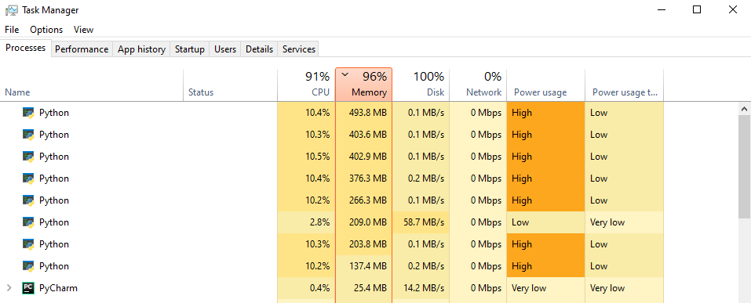

# System Stressor

This is a simple script i wrote out of curiosity while learning about multiprocessors and random number generators

## About

This program is designed to consume all your RAM, CPU and Secondary Memory(HDD/SSD) without actually giving you anything back in return, in the same order as mentioned earlier.

## Installation

Install [python](https://www.python.org/downloads/) or follow a suitable tutorial if you're having problems. I would strongly recommend using python 64 since the instruction set is twice as wide.

## Usage

* Can be used to stress test a machine to understand how it reacts under load.
* Can be used to monitor battery drain of a laptop under load.

## Vulnerability

* If this script is loaded into the start up folder in windows or any comparable os which has such a directory, it can render a machine useless from system startup.

* Running this script even voluntarily is damaging when you have an SSD as a primary boot drive since it forces the system to write page files to the disk which will later be erased once the script is exited. The life span of an SSD is measured by the total size of data written on it. Since the program writes data on your SSD which will later be dumped, it is reducing the life span of the device

## Contributing

Pull requests are welcome. For major changes, please open an issue first to discuss what you would like to change.

Please make sure to update tests as appropriate.

You can also reach me at this [Mail](manand881@gmail.com) address.

## License
[MIT](https://choosealicense.com/licenses/mit/)